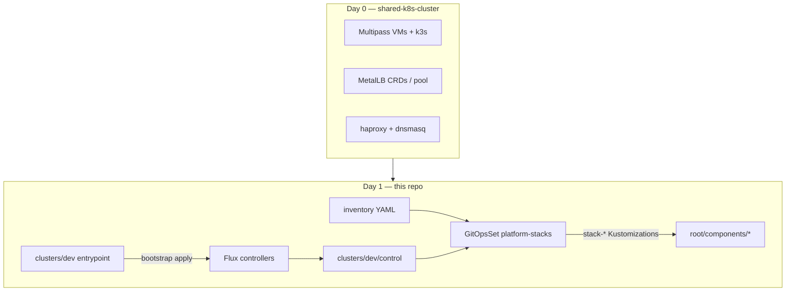

# Design: shared-gitops-k8s-cluster (Flux + GitOpsSets)

- **Status**: `active` (Phase 1 scaffold)
- **Date**: 2026-07-15
- **Repo**: this repository (Day 1+ GitOps)
- **Day 0**: [`shared-k8s-cluster`](../../shared-k8s-cluster/) (Multipass / k3s / LAN proxy)
- **References**: [`metro/sam-fluxcd`](../../metro/sam-fluxcd/), [`weaveworks/gitopssets-controller`](../../weaveworks/gitopssets-controller/)

---

## Decisions locked

| Decision | Choice |
|----------|--------|
| GitOps home | **Separate repo** `shared-gitops-k8s-cluster` |
| Multi-cluster | **Yes** — `dev` / `staging` / `prod` |
| Local Multipass | Cluster id **`dev`** (context `shared-k8s`) |
| Dryness | **gitopssets-controller** (images mirrored to ms02 registry `10.177.76.220:5000`) |
| Product apps | Remain on Tilt (v1) |

### GitOpsSets images (ms02 registry)

Upstream chart tags on ghcr are incomplete for our pin; we **retag + push**:

| Image | Local mirror |
|-------|----------------|
| `ghcr.io/weaveworks/gitopssets-controller:v0.17.2` | `10.177.76.220:5000/weaveworks/gitopssets-controller:v0.17.2` |
| `registry.k8s.io/kubebuilder/kube-rbac-proxy:v0.16.0` | `10.177.76.220:5000/kubebuilder/kube-rbac-proxy:v0.16.0` |

```bash
just push-gitopssets-images
```

HelmRelease values in `gitops/root/controllers/gitopssets/helm-release.yaml` pin these mirrors.
---

## Architecture



### Multi-cluster shape

```
gitops/clusters/{dev,staging,prod}/
  kustomization.yaml     # bootstrap: flux install + sync
  control/               # continuous: gitopssets controller + GitOpsSets
  inventory/stacks/<name>/   # enable a stack = add directory
```

Shared catalogs live in `gitops/inventory/` (`clusters.yaml`, `platform-stacks.yaml`, `metallb-services.yaml`, `apps.yaml`).

Enabling a stack on `dev`:

```bash
mkdir -p gitops/clusters/dev/inventory/stacks/cluster
# ensure gitops/root/components/cluster has real manifests
git commit && git push
# GitOpsSet directories generator picks up the new Base name
```

`staging` / `prod` control kustomizations patch the GitOpsSet directory glob to their own inventory path.

---

## Phase plan

| Phase | Status | Work |
|-------|--------|------|
| 1 Scaffold | **done** | Repo layout, Flux v2.9.2 export, GitOpsSets HR, namespaces component, inventories, just recipes |
| 2 Bootstrap | **done** | Flux + deploy key + gitopssets (images from local weaveworks build → ms02 registry) |
| 3 Migrate stacks | **in progress** | `data` ns on Flux: postgres-ha, minio, postgres-backup, redis, messaging, pact, imgproxy, **mosquitto** (NanoMQ). Remaining: scheduling/pipeline (Tilt), observability, ai, openbao |
| 4 MetalLB dryness | pending | GitOpsSet or tooling from `metallb-services.yaml` → Services + LAN proxy |
| 5 Secrets | pending | OpenBao + External Secrets |
| 6 staging/prod | pending | Real clusters; optional Matrix generator |

---

## Bootstrap checklist (dev)

1. Day 0: `shared-k8s-cluster` → `just cluster-create`
2. Create GitHub repo + push this tree
3. `export KUBECONFIG=…/shared-k8s-cluster/kubeconfig/shared-k8s.yaml`
4. `just create-git-secret keyfile=…` (or HTTPS token secret)
5. `just bootstrap-dev`
6. `flux get ks -A` → expect `cluster-control`, then `stack-namespaces`

---

## Open items

> **Open:** GitHub org/repo URL confirmation (`microscaler/shared-gitops-k8s-cluster` assumed in sync manifests).

> **Open:** Whether MetalLB *operator* stays Day-0-only (recommended) while Services move to GitOps.

> **Open:** Point shared-k8s-cluster LAN proxy tooling at `gitops/inventory/metallb-services.yaml` in this repo (symlink or path config).
