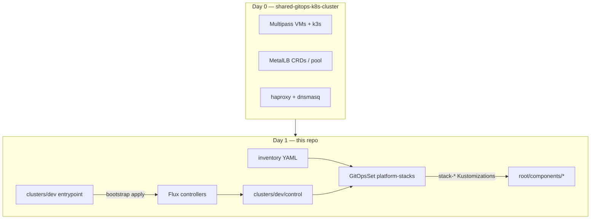

# Design: shared-gitops-k8s-cluster (Flux + GitOpsSets)

- **Status**: `active` (Phase 1 scaffold)
- **Date**: 2026-07-15
- **Repo**: this repository (Day 1+ GitOps)
- **Day 0**: [`shared-gitops-k8s-cluster`](../../shared-gitops-k8s-cluster/) (Multipass / k3s / LAN proxy)
- **References**: [`metro/sam-fluxcd`](../../metro/sam-fluxcd/), [`weaveworks/gitopssets-controller`](../../weaveworks/gitopssets-controller/)

---

## Decisions locked

| Decision | Choice |
|----------|--------|
| GitOps home | **Separate repo** `shared-gitops-k8s-cluster` |
| Multi-cluster | **Yes** — `dev` / `staging` / `prod` |
| Local Multipass | Cluster id **`dev`** (context `shared-k8s`) |
| Dryness | **gitopssets-controller** (images mirrored to ms02 registry `10.177.76.220:5000`) |
| Product apps | Product repos own profiles; Flux reconciles them; Tilt converges to image builds only |

### GitOpsSets images (ms02 registry)

Upstream chart tags on ghcr are incomplete for our pin; we **retag + push**:

| Image | Local mirror |
|-------|----------------|
| `ghcr.io/weaveworks/gitopssets-controller:v0.17.2` | `10.177.76.220:5000/weaveworks/gitopssets-controller:v0.17.2` |
| `registry.k8s.io/kubebuilder/kube-rbac-proxy:v0.16.0` | `10.177.76.220:5000/kubebuilder/kube-rbac-proxy:v0.16.0` |

```bash
just push-gitopssets-images
```

HelmRelease values in `gitops/root/controllers/gitopssets/helm-release.yaml` pin these mirrors.
---

## Architecture



### Multi-cluster shape

```
gitops/clusters/{dev,staging,prod}/
  kustomization.yaml     # bootstrap: flux install + sync
  control/               # continuous: gitopssets controller + GitOpsSets
  inventory/stacks/<name>/   # enable a stack = add directory
```

Shared catalogs live in `gitops/inventory/` (`clusters.yaml`, `platform-stacks.yaml`, `metallb-services.yaml`, `apps.yaml`).
`product-components.yaml` is the source of truth for product repository
sources and suite-qualified profile paths; the `product-components` GitOpsSet
generates Flux sources and reconcilers from it.

RERP Accounting is the first product component. Repository sources and profile
components are separate inventory lists because RERP is a multi-suite monorepo:
future Documents or HR profiles reuse `product-rerp` instead of creating
duplicate GitRepository fetches.

Accounting is reconciled as an ordered pair. `rerp-accounting` owns SOPS
runtime configuration and completion-gated database/object-store Jobs;
`rerp-accounting-services` depends on it and owns only delivered Helm releases.
`rerp-accounting-catalog` applies and prunes suspended HelmRelease declarations
for the rest of the Accounting source inventory without treating those APIs as
delivered or blocking active-service readiness.
The image inventory generates registry scanners and numeric policies for
monotonic `dev-<nanoseconds>` tags. Git-writing image automation is omitted
until the product-specific credential gate is satisfied.

Enabling a stack on `dev`:

```bash
mkdir -p gitops/clusters/dev/inventory/stacks/cluster
# ensure gitops/root/components/cluster has real manifests
git commit && git push
# GitOpsSet directories generator picks up the new Base name
```

`staging` / `prod` control kustomizations patch the GitOpsSet directory glob to their own inventory path.

---

## Phase plan

| Phase | Status | Work |
|-------|--------|------|
| 1 Scaffold | **done** | Repo layout, Flux v2.9.2 export, GitOpsSets HR, namespaces component, inventories, just recipes |
| 2 Bootstrap | **done** | Flux + deploy key + gitopssets (images from local weaveworks build → ms02 registry) |
| 3 Migrate stacks | **done (shared platform)** | Flux owns data + observability + scheduling + pipeline + ai + openbao + cylon/tls/cluster. Product takeover is incremental; RERP Accounting is the first product-repository profile sourced by Flux. postgres-ha replicas still degraded (deferred). |
| 7 Product takeover | **active** | SAM-style GitRepository/Kustomization composition: product repos own profiles and Helm inputs, Flux reconciles configuration/workloads, and Tilt narrows to image builds. |
| 4 MetalLB dryness | **partial** | Inventory aligned + `just check-metallb-inventory`; annotation patches / LAN proxy sync still open |
| 5 Secrets + env config | **active** | `deployment-configuration/profiles/<env>/<component>/` (`application.properties` + SOPS secrets) + Flux `profile-config`; OpenBao/SMC next |
| 6 staging/prod | pending | Real clusters; Matrix list rows ready in `platform-stacks` / `profile-config` |

### Secrets process (locked)

| Item | Choice |
|------|--------|
| Format | `application.properties` (app env) + `helm-values*.yaml` (Helm overlays) + `application.secrets.env` (SOPS) |
| Canonical path | `deployment-configuration/profiles/<env>/<component>/` |
| Flux apply | GitOpsSet `profile-config` → `./deployment-configuration/profiles/dev/<component>` |
| Apply | kustomize `configMapGenerator` + `secretGenerator`; HelmRelease `valuesFrom` for chart knobs |
| Decrypt in-cluster | Flux `decryption.provider: sops` → `flux-system/sops-age` |
| Encrypt workstation | ms02 only; `just secrets-*` recipes |

Details: [`deployment-configuration/README.md`](../deployment-configuration/README.md). OpenBao remains the future backend; this is the GitOps contract we use now.

---

## Bootstrap checklist (dev)

1. Day 0: `shared-gitops-k8s-cluster` → `just cluster-create`
2. Create GitHub repo + push this tree
3. `export KUBECONFIG=…/shared-gitops-k8s-cluster/kubeconfig/shared-k8s.yaml`
4. `just create-git-secret keyfile=…` (or HTTPS token secret)
5. `just bootstrap-dev`
6. `flux get ks -A` → expect `cluster-control`, then `stack-namespaces`

---

## Open items

> **Open:** GitHub org/repo URL confirmation (`microscaler/shared-gitops-k8s-cluster` assumed in sync manifests).

> **Open:** Whether MetalLB *operator* stays Day-0-only (recommended) while Services move to GitOps.

> **Open:** Point shared-gitops-k8s-cluster LAN proxy tooling at `gitops/inventory/metallb-services.yaml` in this repo (symlink or path config).
