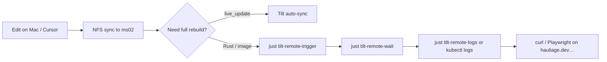

# Remote Tilt workflow (Mac → ms02)

> **Canonical build host:** ms02 NFS (`~/Workspace/microscaler/`). Rust compiles, Tilt, and kubectl run there — not on the Mac.

## Problem

The old loop — SSH to run `cargo check`, or rely on slow NFS-triggered live_update — is high friction. Tilt on ms02 already watches the same NFS tree and rebuilds on file save, but you still need **targeted rebuilds**, **ready gates**, and **log tailing** without opening six browser tabs.

## What works today (verified 2026-07-10)

| Step | From Mac | Notes |
|------|----------|-------|
| **Trigger rebuild** | `tilt trigger bff --host 192.168.1.189 --port 10352` | ✅ Works cross-network |
| **Wait until ready** | `ssh ms02 'tilt wait --port 10352 --for=condition=Ready uiresource/bff'` | ✅ ~5–30s typical |
| **Tilt UI** | `http://192.168.1.189:10352/` or `http://tilt-hauliage.dev.microscaler.local/` | After `just lan-proxy-up` + DNS |
| **Tilt build logs** | `ssh ms02 'tilt logs bff --port 10352 -f'` | ✅ Use ssh — see version skew below |
| **Runtime pod logs** | `ssh ms02 'kubectl logs -n hauliage deploy/bff -f'` | BFF/microservice stdout |
| **Smoke app** | `curl http://hauliage.dev.microscaler.local/` | Production-shaped path (nginx → BFF) |

### `just` shortcuts (shared-gitops-k8s-cluster)

```bash
cd ~/Workspace/microscaler/shared-gitops-k8s-cluster

# Trigger + wait
just tilt-remote-cycle hauliage bff

# Or separately
just tilt-remote-trigger hauliage identity-session-service   # sesame tilt on 10351
just tilt-remote-wait hauliage bff
just tilt-remote-logs hauliage bff
```

App → port map: [`deploy/APPS.md`](../deploy/APPS.md).

## Recommended edit → build → deploy → monitor loop



1. **Edit** in Cursor (workspace on NFS or Mac mirror — same files ms02 Tilt watches).
2. **Trigger** only when you need a full image rebuild (Rust `custom_build`, stub regen, Helm redeploy). For frontend static assets, Tilt `live_update` often picks up `frontend/dist` without a trigger.
3. **Wait** on `uiresource/<name>` before smoke tests — avoids racing a rolling update.
4. **Monitor** build output via `just tilt-remote-logs` (ssh); runtime via `kubectl logs`.
5. **Verify** via `http://hauliage.dev.microscaler.local/` (not Vite) for BFF/nginx path.

## DNS / Envoy Tilt endpoints

`*.dev.microscaler.local` is routed by **Envoy Gateway** (GitOps HTTPRoutes). Lan-proxy
only TCP-forwards `:80/:443` to MetalLB `ENVOY_GATEWAY_LB_IP` (`.234`).

| Hostname | Tilt port | Repo |
|----------|-----------|------|
| `https://tilt-hauliage.dev.microscaler.local/` | 10352 | hauliage |
| `https://tilt-sesame.dev.microscaler.local/` | 10351 | seasame-idam |

Routes live in `gitops/root/components/envoy-gateway/httproutes/tilt-hosts.yaml`
(Endpoints → Multipass host `10.177.76.1`). UFW must allow `10.177.76.0/24` → `:10351/:10352`
(`tools/lan_firewall.py`).

Apply on ms02:

```bash
just dev-dns-up          # wildcard + extra hostnames
just lan-proxy-up        # thin TCP → Envoy
```

Mac: `just dev-dns-mac-install` (once).

**Browser UI:** use `https://tilt-hauliage.dev.microscaler.local/` (haproxy → Envoy → Tilt).

**CLI trigger/logs:** use ms02 LAN IP + Tilt port directly — the Tilt CLI against `:80` can mis-route (Host/SNI quirks). Prefer:

```bash
tilt trigger bff --host 192.168.1.189 --port 10352
# or: just tilt-remote-trigger hauliage bff
```

## Known gaps

### Mac `tilt logs` vs ms02 Tilt (version skew)

- ms02 systemd Tilt: **v0.36.3**
- Mac Homebrew Tilt: **v0.37.0** (as of 2026-07-10)

`tilt logs --host 192.168.1.189 --port 10352` from Mac fails with timestamp parse errors. **Workaround:** tail via ssh (`just tilt-remote-logs`) or pin Mac Tilt to match ms02.

### `cargo test` / BDD on ms02

Integration tests need port-forwards or LAN proxy for Postgres/Redis:

```bash
ssh ms02 'cd ~/Workspace/microscaler/seasame-idam/microservices && \
  cargo test -p sesame_idam_identity_login_service --test main_bdd token_lifecycle -- --nocapture'
```

Skips with "Postgres and/or Redis not available" when forwards are down — not a code failure.

## Future improvements

- **Align Tilt versions** on Mac and ms02 (fixes remote `tilt logs -f`).
- **Tiltfile `trigger_mode=TRIGGER_MODE_MANUAL`** on heavy Rust builds — save CPU; Mac agent runs `tilt trigger` explicitly.
- **Webhook / Cursor task** wrapping `just tilt-remote-cycle` after save (optional automation layer on top of this flow).
